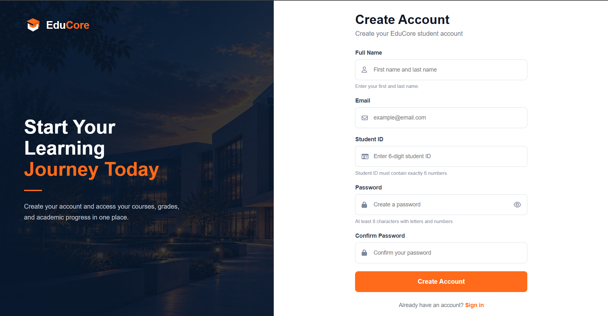
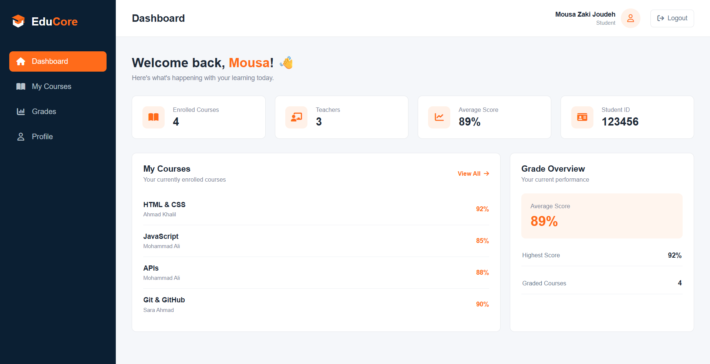
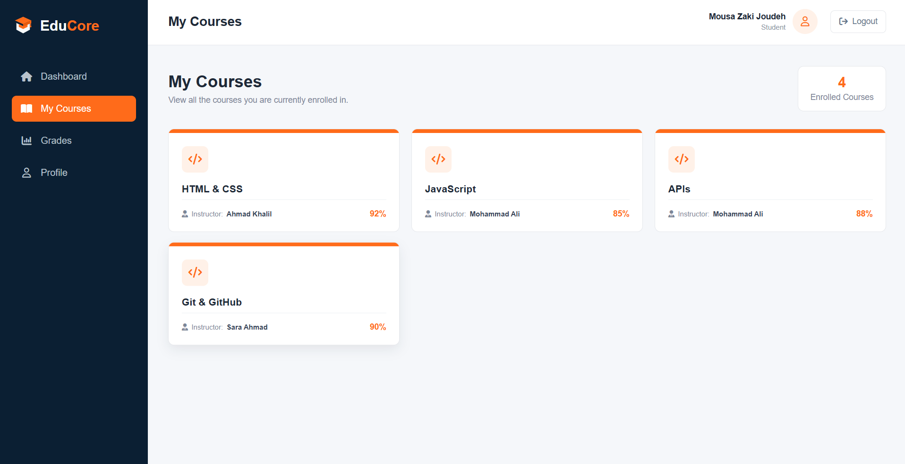
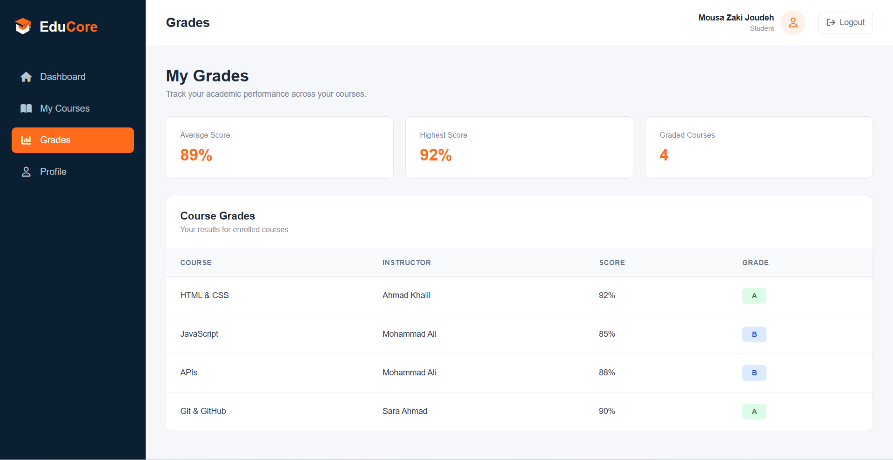
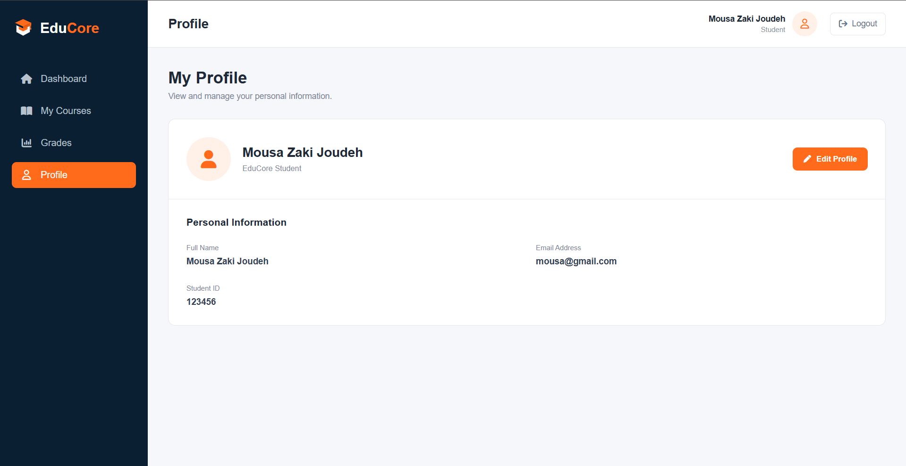

# 🎓 EduCore – Student Portal

EduCore is a responsive student portal built using HTML, CSS, and Vanilla JavaScript. It allows students to create accounts, log in, manage their profiles, and view their enrolled courses and grades.

This project was developed as part of the Orange Coding Academy training program.

## Features

- **Student Registration:** Create an account with form validation and duplicate email/Student ID checks.
- **Login & Authentication:** Log in using registered credentials.
- **Remember Me:** Store login sessions using localStorage or sessionStorage.
- **Protected Pages:** Prevent unauthenticated users from accessing student pages.
- **Dashboard:** View student information, enrolled courses, teachers, and grade statistics.
- **My Courses:** Display enrolled courses, instructors, and scores.
- **Grades:** View course grades, average score, highest score, and letter grades.
- **Profile Management:** View and update personal information.
- **Logout:** Clear the current session and return to the login page.
- **Error Handling:** Display error messages and retry options when the API is unavailable.
- **Responsive Design:** Support desktop, tablet, and mobile screens with a hamburger navigation menu.
- **Password Visibility Toggle:** Show or hide passwords in authentication forms.

## Technologies Used

- HTML5
- CSS3
- JavaScript (ES6 Modules)
- JSON Server (Mock REST API)
- Local Storage & Session Storage
- Font Awesome Icons

## Project Structure

```text
EduCore/
├── assets/
├── js/
│   ├── api.js
│   ├── auth.js
│   ├── dashboard.js
│   ├── courses.js
│   ├── grades.js
│   ├── profile.js
│   └── sidebar.js
├── pages/
│   ├── index.html
│   ├── register.html
│   ├── dashboard.html
│   ├── courses.html
│   ├── grades.html
│   └── profile.html
├── style/
│   ├── auth.css
│   └── dashboard.css
├── db.json
├── package.json
└── README.md
```

## Getting Started

### 1. Clone the Repository

```bash
git clone [](https://github.com/Mousa-Joudeh/EduCore-Student-Portal.git)
```

Then open the project folder:

```bash
cd EduCore
```

### 2. Install Dependencies

Make sure Node.js and npm are installed.

Run:

```bash
npm install
```

### 3. Start JSON Server

Run:

```bash
npx json-server db.json
```

The API will be available at:

```text
http://localhost:3000
```

### 4. Run the Website

Open the project in Visual Studio Code.

Use the **Live Server** extension to open:

```text
pages/index.html
```

Register a new student account or log in using an existing account.

**Note:** Keep JSON Server running while using the website because student information, courses, and grades are loaded from the local API.

## API Resources

The project uses JSON Server to manage the following resources:

| Resource       | Description                              |
| -------------- | ---------------------------------------- |
| `/students`    | Student accounts and profile information |
| `/courses`     | Available courses                        |
| `/teachers`    | Course instructors                       |
| `/enrollments` | Student course enrollments               |
| `/scores`      | Student course grades                    |

## Screenshots

### Login Page


### Registration Page



### Dashboard



### My Courses



### Grades



### Profile



## Project Purpose

The goal of this project is to practice working with JavaScript ES6 modules, REST APIs, form validation, authentication, browser storage, and responsive web design.

## Author

**Mousa Joudeh**

Full Stack Web Development Trainee  
Orange Coding Academy
